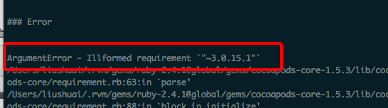
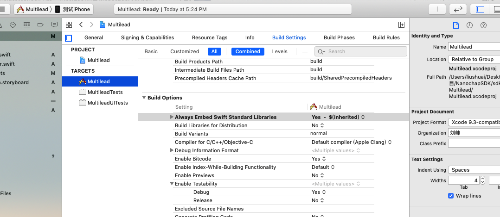

# CocoaPods使用

### Podfile文件设置
- 忽略引入库的所有警告
```
inhibit_all_warnings!
```

### 三方库版本管理
- 在`podfile.lock`或`Manifest.lock`中有当前安装的三方库版本

### 创建公有库注意事项
- 先查看公有库名字有没有重复

### 本地校验报错 `pod podspec file not found with <angled>`
    
 本地校验出现三方库引用错误，找不到文件，是因为三方库引用有问题，例如引用`AFNetworking`，正确引用`<AFNetworking/AFNetworking.h>`，错误引用`<AFNetworking.h>`
 
### [!] Oh no, an error occurred
- 执行 pod install 时报错
- 在Error下面有错误原因


### target overrides the `ALWAYS_EMBED_SWIFT_STANDARD_LIBRARIES`


- 解决办法



### 安装libwebp报错

`cocoapods`安装`SDWebimage`时依赖三方库`libwebp`，默认`libwebp`是在谷歌服务器上的，安装时会报错

```
[!] Error installing libwebp
[!] /usr/bin/git clone https://chromium.googlesource.com/webm/libwebp /var/folders/8m/s1m07k7j34d84z93yw6lmj0m0000gp/T/d20200403-87380-8sxq3p --template= --single-branch --depth 1 --branch v1.0.2

Cloning into '/var/folders/8m/s1m07k7j34d84z93yw6lmj0m0000gp/T/d20200403-87380-8sxq3p'...
fatal: unable to access 'https://chromium.googlesource.com/webm/libwebp/': Failed to connect to chromium.googlesource.com port 443: Operation timed out

```