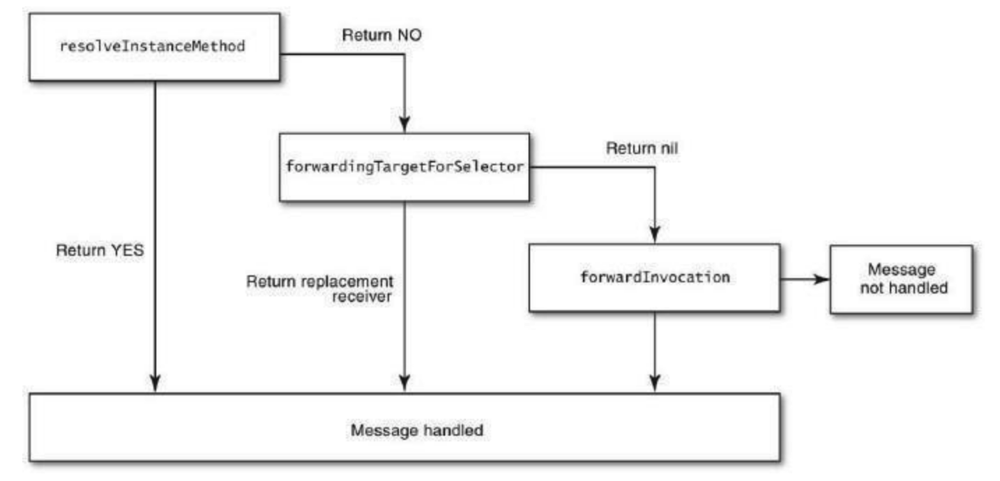
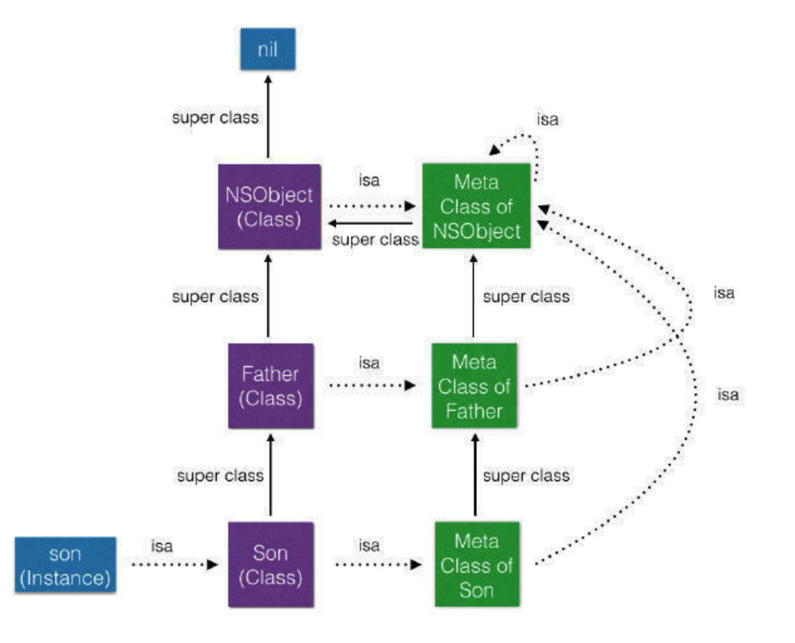

# 运行时机制
　　消息机制，OC的方法调用称作为`消息发送`，属于动态调用过程。

　　在 Objc.h 中我们可以看到id的定义
```objc
/* OC方法调用 */
[obj makeTest];
/* 编译时Runtime会将上面的代码转为下面的消息发送 */
objc_msgSend(obj, @selector(makeText));
```
```objc
@interface NSObject{
Class isa;
};
typedef struct objc_class *Class;
struct objc_class {
Class isa; // 指向metaclass，也就是静态的Class
Class super_class ; // 指向其父类
const char *name ; // 类名
long version ; // 类的版本信息，初始化默认为0
/* 一些标识信息，如CLS_CLASS(0x1L)表示该类为普通class;
CLS_META(0x2L)表示该类为metaclass */
long info; 
long instance_size ; // 该类的实例变量大小(包括从父类继承下来的实例变量);
struct objc_ivar_list *ivars; // 用于存储每个成员变量的地址
/* 与info的一些标志位有关,如是普通class则存储对象方法，如是metaclass则存储类方法; */
struct objc_method_list **methodLists ; 
struct objc_cache *cache; // 指向最近使用的方法的指针，用于提升效率；
struct objc_protocol_list *protocols; // 存储该类遵守的协议
};
```
　　在 objc_msgSend 函数的调用过程：
1. 首先通过obj的isa指针找到obj对应的Class。
2。 在Class中先去cache中通过SEL查找对应函数method
3. 若cache中未找到，再去methodLists中查找
4. 若methodLists中未找到，则进入superClass按前面的步骤进行递归查找
5. 若找到method，则将method加入到cache中，以方便下次查找，并通过method中的函数指针跳转到对应的函数中去执行。
6. 如果一直查找到NSObject还没查找到，则会进入消息动态处理流程  

#### 消息动态处理流程

```objc
/* 1. 时机处理之一，在这个方法中我们可以利用runtime的特性动态添加方法来处理 */
+ (BOOL)resolveInstanceMethod:(SEL)sel;
/* 2. 时机处理之二，在这个方法中看代理能不能处理，如果代理对象能处理，则转接给代理对象 */
- (id)forwardingTargetForSelector:(SEL)aSelector;
/* 3. 消息转发之一，该方法返回方法签名，如果返回nil，则转发流程终止，抛出异常 */
- (NSMethodSignature *)methodSignatureForSelector:(SEL)aSelector;
/* 4. 消息转发之二，在该方法中我们可以对调用方法进行重定向 */
- (void)forwardInvocation:(NSInvocation *)anInvocation;
```


#### 利用Runtime动态添加方法或属性

```objc
/* 动态向一个类添加属性 */
class_addIvar(kclass, "expression", size, alignment, "*");
/* 动态向一个类添加方法 */
class_addMethod(kclass, @selector(setExpressionFormula:), (IMP)setExpressionFormula, "v@:@");
class_addMethod(kclass, @selector(getExpressionFormula), (IMP)getExpressionFormula, "@@:");
static void setExpressionFormula(id self, SEL cmd, id value){           
NSLog(@"call setExpressionFormula");  
}
static id getExpressionFormula(id self, SEL cmd)  {        
NSLog(@"call getExpressionFormula");  
return nil;
}
```

1. v表示void，@表示id类型，:表示SEL类型
2. "v@:@"：表示返回值为void，接受一个id类型、一个SEL类型、一个id类型的方法
3. "@@:"：表示返回值为id类型，接受一个id类型和一个SEL类型参数的方法


## Class 与 MetaClass
　　首先了解几个概念
#### id 

```objc
/// A pointer to an instance of a class.
typedef struct objc_object *id;
```  
　　id 是一个指向 objc_object 的指针。  

#### objc_object
　　在 Objc.h 中的定义如下

```obj
/// Represents an instance of a class.
struct objc_object {
Class isa  OBJC_ISA_AVAILABILITY;
};
```
　　objc_object会被转换成 C 的结构体，而在这个结构体中有一个 isa 指针，指向它的类别 Class。

#### Class
　　Class定义如下

```objc
/// An opaque type that represents an Objective-C class.
typedef struct objc_class *Class;
```
　　Class 本身指向的也是一个 C 的结构体 `objc_class`

#### objc_class
　　在 runtime.h 中的定义如下
    
```objc
struct objc_class {
Class isa  OBJC_ISA_AVAILABILITY;

#if !__OBJC2__
Class super_class                                        OBJC2_UNAVAILABLE;
const char *name                                         OBJC2_UNAVAILABLE;
long version                                             OBJC2_UNAVAILABLE;
long info                                                OBJC2_UNAVAILABLE;
long instance_size                                       OBJC2_UNAVAILABLE;
struct objc_ivar_list *ivars                             OBJC2_UNAVAILABLE;
struct objc_method_list **methodLists                    OBJC2_UNAVAILABLE;
struct objc_cache *cache                                 OBJC2_UNAVAILABLE;
struct objc_protocol_list *protocols                     OBJC2_UNAVAILABLE;
#endif

} OBJC2_UNAVAILABLE;
/* Use `Class` instead of `struct objc_class *` */
```
#### MetaClass
　　我们发现 Class 本身也有一个 `isa` 指针，指向的是它的 `MetaClass`。
- 当我们对一个实例发送消息是（- 开头的方法），会在该 instance 对应的类 methodLists里查找。
- 当我们对一个类发送消息时（+ 开头的的方法），会在该类的 MetaClass 的 methodLists里查找。  

　　过程如下


- 每个 Class 都有一个 isa 指针指向一个唯一的 Meta Class。
- 每一个 Meta Class 的 isa 指针都指向嘴上层的 Meta Class，即 NSObject的 MetaClass，而最上层的 MetaClass 的 isa 指针指向自己。

