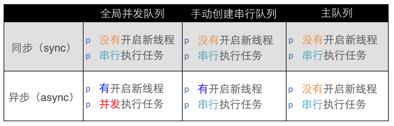

# 多线程
- 线程: 系统调度的单位
    1. 单线程：
    2. 多线程：每条线程可以并行(同时)执行不同的任务
    3. 同步：线程B需要等线程A执行完后才能执行，一般用在两个线程执行同一资源时，为了保证线程安全所设
    4. 异步：线程A和线程B可以同时执行
    5. 在GCD中同步不创建线程，异步创建线程
- 队列：先进先出为队列
    1. 并行：多核CPU微观上就是多个线程同时执行
    2. 串行：
    3. 并发：单核CPU宏观上感觉多个线程同时执行，在多个线程来回跳转执行
- 线程安全
- 线程的串行: 一个线程中任务的执行是串行的, 如果要在一个线程中执行多个任务, 那么只能一个一个的按顺序执行这些任务
- 并行和并发区别：都是指多个任务同时执行，区别就是，多任务是否执行于严格的同一时刻，并发不是，并行是

1. 异步函数+并行队列
    - 函数内的任务都是创建完后在执行，可以新建线程，各线程也是并发执行
2. 同步函数+并发队列
    - iOS中同步函数不新建线程，任务是创建一个立马执行，执行完再创建下一个。因为是同步函数，也就不存在并发了
3. 异步函数+串行队列
    - 可以创建新线程，但是因为是串行队列，所以实际上也只是开了一条新线程，做完一个，在做另一个
4. 同步函数 + 串行队列
    - 不会开新线程，也是串行的
5. 在主队列中用异步函数创建任务
    - 注意：因为主队列是串行队列，所以和异步函数＋串行队列的搭配是一样的，而且是在主线程执行的。因为只要加到主队列，就一定是加载主线程。不论是同步还是异步。

6. 在主队列用同步函数创建任务，是会卡住的

## GCD
一、简单介绍

1.什么是GCD？

全称是Grand Central Dispatch，可译为“牛逼的中枢调度器”
纯C语言，提供了非常多强大的函数

2.GCD的优势

- GCD是苹果公司为多核的并行运算提出的解决方案

- GCD会自动利用更多的CPU内核（比如双核、四核）

- GCD会自动管理线程的生命周期（创建线程、调度任务、销毁线程）

程序员只需要告诉GCD想要执行什么任务，不需要编写任何线程管理代码

3.提示

(1) GCD存在于libdispatch.dylib这个库中，这个调度库包含了GCD的所有的东西，但任何IOS程序，默认就加载了这个库，在程序运行的过程中会动态的加载这个库，不需要我们手动导入。
点击+a按钮，可以导入框架。

(2) GCD是纯C语言的，因此我们在编写GCD相关代码的时候，面对的函数，而不是方法。

(3) GCD中的函数大多数都以dispatch开头。

二、任务和队列

GCD中有2个核心概念

（1）任务：执行什么操作

（2）队列：用来存放任务

GCD的使用就2个步骤

（1）定制任务

（2）确定想做的事情

将任务添加到队列中，GCD会自动将队列中的任务取出，放到对应的线程中执行

提示：任务的取出遵循队列的FIFO原则：先进先出，后进后出

三、执行任务

1.GCD中有2个用来执行任务的函数

说明：把右边的参数（任务）提交给左边的参数（队列）进行执行。
（1）用同步的方式执行任务 dispatch_sync(dispatch_queue_t queue, dispatch_block_t block);

参数说明：

queue：队列

block：任务

（2）用异步的方式执行任务 dispatch_async(dispatch_queue_t queue, dispatch_block_t block);

2.同步和异步的区别

同步：在当前线程中执行

异步：在另一条线程中执行

四、队列

1.队列的类型

GCD的队列可以分为2大类型

（1）并发队列（Concurrent Dispatch Queue）

可以让多个任务并发（同时）执行（自动开启多个线程同时执行任务）并发功能只有在异步（dispatch_async）函数下才有效

（2）串行队列（Serial Dispatch Queue）

让任务一个接着一个地执行（一个任务执行完毕后，再执行下一个任务）

2.补充说明

有4个术语比较容易混淆：同步、异步、并发、串行

同步和异步决定了要不要开启新的线程

同步：在当前线程中执行任务，不具备开启新线程的能力

异步：在新的线程中执行任务，具备开启新线程的能力

并发和串行决定了任务的执行方式

并发：多个任务并发（同时）执行

串行：一个任务执行完毕后，再执行下一个任务

3.串行队列

GCD中获得串行有2种途径

（1）使用dispatch_queue_create函数创建串行队列

dispatch_queue_t  dispatch_queue_create(const char *label,  dispatch_queue_attr_t attr); // 队列名称， 队列属性，一般用NULL即可

示例：

dispatch_queue_t queue = dispatch_queue_create("wendingding", NULL); // 创建

dispatch_release(queue); // 非ARC需要释放手动创建的队列

（2）使用主队列（跟主线程相关联的队列）

主队列是GCD自带的一种特殊的串行队列,放在主队列中的任务，都会放到主线程中执行

使用dispatch_get_main_queue()获得主队列

示例：

dispatch_queue_t queue = dispatch_get_main_queue();

4.并发队列

GCD默认已经提供了全局的并发队列，供整个应用使用，不需要手动创建

```objc

使用dispatch_get_global_queue函数获得全局的并发队列

dispatch_queue_t dispatch_get_global_queue(dispatch_queue_priority_t priority,unsigned long flags); // 此参数暂时无用，用0即可

示例：
这个参数是留给以后用的，暂时用不上，传个0。
第一个参数为优先级，这里选择默认的。获取一个全局的默认优先级的并发队列。

dispatch_queue_t queue = dispatch_get_global_queue(DISPATCH_QUEUE_PRIORITY_DEFAULT, 0); // 获得全局并发队列


说明：全局并发队列的优先级

#define DISPATCH_QUEUE_PRIORITY_HIGH 2 // 高

#define DISPATCH_QUEUE_PRIORITY_DEFAULT 0 // 默认（中）

#define DISPATCH_QUEUE_PRIORITY_LOW (-2) // 低

#define DISPATCH_QUEUE_PRIORITY_BACKGROUND INT16_MIN // 后台
```
5.各种队列的执行效果


五、代码示例

（1）用异步函数往并发队列中添加任务

```objc

 9 #import "YYViewController.h"
10
11 @interface YYViewController ()
12
13 @end
14
15 @implementation YYViewController
16
17 - (void)viewDidLoad
18 {
19     [super viewDidLoad];
20     //1.获得全局的并发队列
21    dispatch_queue_t queue =  dispatch_get_global_queue(DISPATCH_QUEUE_PRIORITY_DEFAULT, 0);
22     //2.添加任务到队列中，就可以执行任务
23     //异步函数：具备开启新线程的能力
24     dispatch_async(queue, ^{
25         NSLog(@"下载图片1----%@",[NSThread currentThread]);
26     });
27     dispatch_async(queue, ^{
28         NSLog(@"下载图片2----%@",[NSThread currentThread]);
29     });
30     dispatch_async(queue, ^{
31         NSLog(@"下载图片2----%@",[NSThread currentThread]);
32     });
33 //打印主线程
34     NSLog(@"主线程----%@",[NSThread mainThread]);
35
36 }
37
38 @end
```
总结：同时开启三个子线程


（2）用异步函数往串行队列中添加任务
```objc
 9 #import "YYViewController.h"
10
11 @interface YYViewController ()
12
13 @end
14
15 @implementation YYViewController
16
17 - (void)viewDidLoad
18 {
19     [super viewDidLoad];
20
21     //打印主线程
22     NSLog(@"主线程----%@",[NSThread mainThread]);
23
24     //创建串行队列
25     dispatch_queue_t  queue= dispatch_queue_create("wendingding", NULL);
26     //第一个参数为串行队列的名称，是c语言的字符串
27     //第二个参数为队列的属性，一般来说串行队列不需要赋值任何属性，所以通常传空值（NULL）
28
29     //2.添加任务到队列中执行
30     dispatch_async(queue, ^{
31         NSLog(@"下载图片1----%@",[NSThread currentThread]);
32     });
33     dispatch_async(queue, ^{
34         NSLog(@"下载图片2----%@",[NSThread currentThread]);
35     });
36     dispatch_async(queue, ^{
37         NSLog(@"下载图片2----%@",[NSThread currentThread]);
38     });
39
40     //3.释放资源
41 //    dispatch_release(queue);
42 }
43
44 @end
```
总结：会开启线程，但是只开启一个线程

（3）用同步函数往并发队列中添加任务
```objc
 9 #import "YYViewController.h"
10
11 @interface YYViewController ()
12
13 @end
14
15 @implementation YYViewController
16 /**
17  *  用同步函数往并发队列中添加任务
18  */
19 - (void)viewDidLoad
20 {
21     [super viewDidLoad];
22
23     //打印主线程
24     NSLog(@"主线程----%@",[NSThread mainThread]);
25
26     //创建串行队列
27     dispatch_queue_t  queue= dispatch_get_global_queue(DISPATCH_QUEUE_PRIORITY_DEFAULT, 0);
28
29
30     //2.添加任务到队列中执行
31     dispatch_sync(queue, ^{
32         NSLog(@"下载图片1----%@",[NSThread currentThread]);
33     });
34     dispatch_sync(queue, ^{
35         NSLog(@"下载图片2----%@",[NSThread currentThread]);
36     });
37     dispatch_sync(queue, ^{
38         NSLog(@"下载图片3----%@",[NSThread currentThread]);
39     });
40 }
41
42 @end
```
总结：不会开启新的线程，并发队列失去了并发的功能

（4）用同步函数往串行队列中添加任务
```objc
 9 #import "YYViewController.h"
10
11 @interface YYViewController ()
12
13 @end
14
15 @implementation YYViewController
16
17
18 /**
19  *用同步函数往串行队列中添加任务
20  */
21 - (void)viewDidLoad
22 {
23     [super viewDidLoad];
24      NSLog(@"用同步函数往串行队列中添加任务");
25     //打印主线程
26     NSLog(@"主线程----%@",[NSThread mainThread]);
27
28     //创建串行队列
29     dispatch_queue_t  queue= dispatch_queue_create("wendingding", NULL);
30
31     //2.添加任务到队列中执行
32     dispatch_sync(queue, ^{
33         NSLog(@"下载图片1----%@",[NSThread currentThread]);
34     });
35     dispatch_sync(queue, ^{
36         NSLog(@"下载图片2----%@",[NSThread currentThread]);
37     });
38     dispatch_sync(queue, ^{
39         NSLog(@"下载图片3----%@",[NSThread currentThread]);
40     });
41 }
42
43 @end
```
总结：不会开启新的线程

（5）补充

补充：队列名称的作用：
将来调试的时候，可以看得出任务是在哪个队列中执行的。

（6）小结

说明：同步函数不具备开启线程的能力，无论是什么队列都不会开启线程；异步函数具备开启线程的能力，开启几条线程由队列决定（串行队列只会开启一条新的线程，并发队列会开启多条线程）。

同步函数

（1）并发队列：不会开线程

（2）串行队列：不会开线程

异步函数

（1）并发队列：能开启N条线程

（2）串行队列：开启1条线程

补充：
凡是函数中，各种函数名中带有create\copy\new\retain等字眼，都需要在不需要使用这个数据的时候进行release。
GCD的数据类型在ARC的环境下不需要再做release。
CF（core Foundation）的数据类型在ARC环境下还是需要做release。
异步函数具备开线程的能力，但不一定会开线程

## 多个网络请求

多个网络同时请求，等到所有请求全部返回结果后在刷新UI，可以使用信号量

```objc
//信号量
     dispatch_semaphore_t semaphore = dispatch_semaphore_create(0);
    //创建全局并行
    dispatch_group_t group = dispatch_group_create();
    dispatch_queue_t queue = dispatch_get_global_queue(DISPATCH_QUEUE_PRIORITY_DEFAULT, 0);
    //任务一
    dispatch_group_async(group, queue, ^{
        [self getAdvertList:^{ //这个block是此网络任务异步请求结束时调用的,代表着网络请求的结束.
        //一个任务结束时标记一个信号量
             dispatch_semaphore_signal(semaphore);
        }];
    });
    //任务二
    dispatch_group_async(group, queue, ^{
        [self getHotCultureList:^{
            dispatch_semaphore_signal(semaphore);
        }];
    });
    //任务三
    dispatch_group_async(group, queue, ^{
        [self getSurroundCulture:^{
            dispatch_semaphore_signal(semaphore);
        }];
    });
    //任务四
    dispatch_group_async(group, queue, ^{
        [self getMySubscibe:^{
             dispatch_semaphore_signal(semaphore);
        }];

    });
    //任务五
    dispatch_group_async(group, queue, ^{
        [self getRecommendCulture:^{
             dispatch_semaphore_signal(semaphore);
        }];
    });
    //任务六
    dispatch_group_async(group, queue, ^{
         [self getNews:^{
              dispatch_semaphore_signal(semaphore);
         }];
    });

    dispatch_group_notify(group, queue, ^{
    //6个任务,6个信号等待.
        dispatch_semaphore_wait(semaphore, DISPATCH_TIME_FOREVER);
        dispatch_semaphore_wait(semaphore, DISPATCH_TIME_FOREVER);
        dispatch_semaphore_wait(semaphore, DISPATCH_TIME_FOREVER);
        dispatch_semaphore_wait(semaphore, DISPATCH_TIME_FOREVER);
        dispatch_semaphore_wait(semaphore, DISPATCH_TIME_FOREVER);
        dispatch_semaphore_wait(semaphore, DISPATCH_TIME_FOREVER);
        //这里就是所有异步任务请求结束后执行的代码
         [self.homeTableView.mj_header endRefreshing];

    });
-(void)getAdvertList:(void(^)())finish{
    //网络请求..成功后调用一下finish,失败也调用finish
}
```
