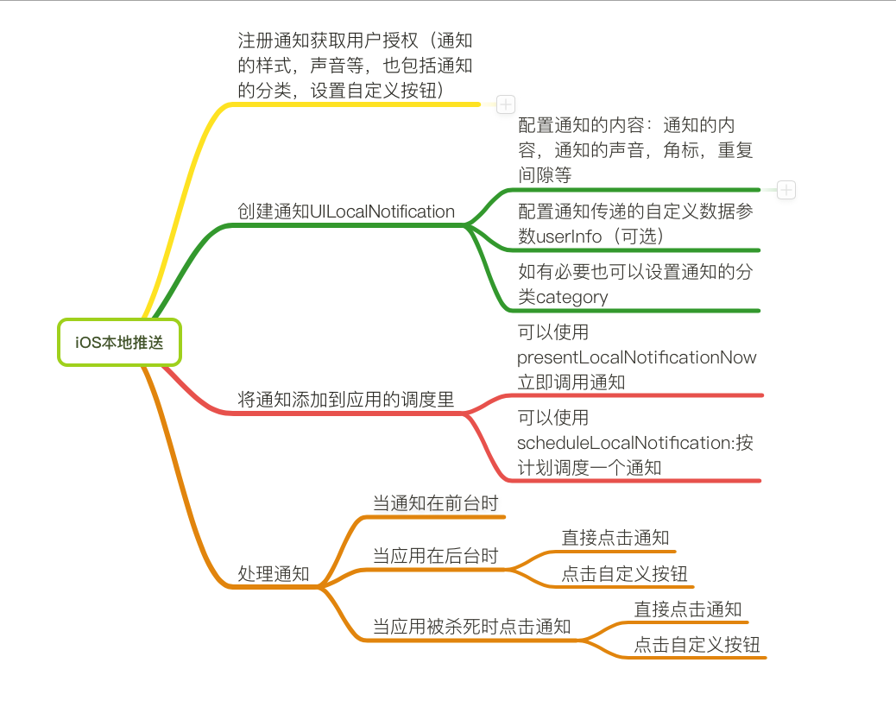
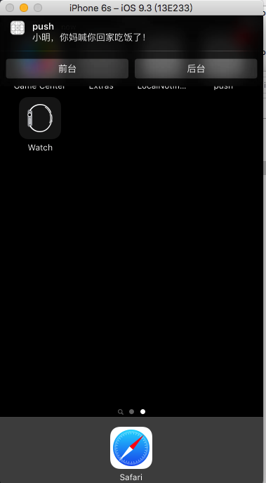
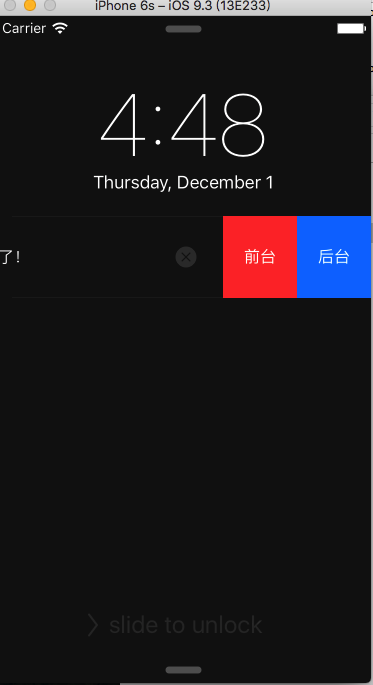
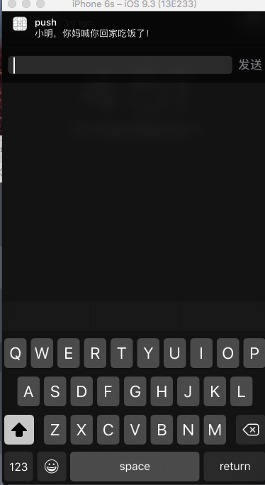

# 本地通知
  可以在某一时间对用户进行提醒，典型的例如日历，备忘录等。

  

  上面这张图显示了开发本地通知的一个大概流程

##详细流程：

###注册通知
   不论是本地通知，还是远程通知我们首先都是向iOS注册通知并且获得用户授权的。如果用户关闭通知，我们是不能发送通知的。
- 注册通知可以设置通知的声音，角标，和通知的样式等。
- 可以将通知进行分类，这样在接收到不同的通知的时候，应用可以根据不同的通知进行处理，不同的通知也可以设置各自的按钮。应用可以根据用户点击的按钮进行处理点击事件。
- 注册通知的代码清单

```objc
            /*
         UIUserNotificationType:

         UIUserNotificationTypeBadge   = 1 << 0, // 接收到通知可更改程序的应用图标
         UIUserNotificationTypeSound   = 1 << 1, // 接收到通知可播放声音
         UIUserNotificationTypeAlert   = 1 << 2, // 接收到通知课提示内容
         如果你需要使用多个类型,可以使用 "|" 来连接
         */

        // 向用户请求通知权限
        /**
         *  - [UIUserNotificationSettings settingsForTypes: categories] 方法中types参数传递的是通知提醒的方式，categories需要传一个NSSet集合，集合里是UIUserNotificationCategory对象，官方推荐使用子类NSMutableUserNotificationCategory。这个类是用来给通知动态添加按钮的
            NSMutableUserNotificationCategory 设置标识符，设置actions，每个action代表一个按键

         */
        // 1. 设置通知类型
        UIUserNotificationType types = UIUserNotificationTypeBadge | UIUserNotificationTypeSound | UIUserNotificationTypeAlert;
        // 2. 创建通知的行为按钮
        // 2.1 创建第一个行为
        UIMutableUserNotificationAction *action1 = [[UIMutableUserNotificationAction alloc] init];
        // >1 设置行为的唯一标识
        action1.identifier = @"后台按钮1";
        // >2 设置按钮标题
        action1.title = @"后台";
        // >3 当按钮执行的时候应用运行的模式
        action1.activationMode = UIUserNotificationActivationModeBackground;
        // >4 是否只有锁屏状态才能显示
        action1.authenticationRequired = NO;
        // >5 按钮的性质
        /*
         destructive属性设置后，在通知栏或锁屏界面左划，按钮颜色会变为红色
         如果两个按钮均设置为YES，则均为红色（略难看）
         如果两个按钮均设置为NO，即默认值，则第一个为蓝色，第二个为浅灰色
         如果一个YES一个NO，则都显示对应的颜色，即红蓝双色 (CP色)。
         */
        action1.destructive = NO;

        // >6 设置按钮的行为，UIUserNotificationActionBehaviorTextInput可以输入内容
        action1.behavior = UIUserNotificationActionBehaviorTextInput;

        //这个字典定义了当点击了评论按钮后，输入框右侧的按钮名称，如果不设置该字典，则右侧按钮名称默认为 “发送”
        action1.parameters = @{UIUserNotificationTextInputActionButtonTitleKey: @"发送"};


        // 创建第二个按钮
        UIMutableUserNotificationAction *action2 = [[UIMutableUserNotificationAction alloc] init];
        action2.identifier = @"前台按钮1";
        action2.title = @"前台";
        //        UIUserNotificationActivationModeForeground, // 当应用在前台的时候触发
        //        UIUserNotificationActivationModeBackground  // 即使应用不在前台也触发

        //当点击的时候不启动程序，在后台处理
        action2.activationMode = UIUserNotificationActivationModeForeground;
        // 用户必须输入密码才能执行
        //需要解锁才能处理(意思就是如果在锁屏界面收到通知，并且用户设置了屏幕锁，用户点击了赞不会直接进入我们的回调进行处理，而是需要用户输入屏幕锁密码之后才进入我们的回调)，如果action.activationMode = UIUserNotificationActivationModeForeground;则这个属性被忽略；
        action2.authenticationRequired = YES;
        action2.destructive = YES;

        // 3. 创建用户通知分类
        UIMutableUserNotificationCategory *category = [[UIMutableUserNotificationCategory alloc] init];
        // 3.1 设置类别的唯一标识
        category.identifier = @"myCategory";
        // 3.2 设置通知的按钮
        //        UIUserNotificationActionContextDefault,  //默认上下文(情景)下的英文(通常都是)
        //        UIUserNotificationActionContextMinimal   //通知内容区域受限情况下内容
        [category setActions:@[action1, action2] forContext:UIUserNotificationActionContextDefault];

        // 4. 创建用户通知的设置信息
        UIUserNotificationSettings *setting = [UIUserNotificationSettings settingsForTypes:types categories:[NSSet setWithObject:category]];
        // 5. 注册通知
        [[UIApplication sharedApplication] registerUserNotificationSettings:setting];
```
UIUserNotificationType为枚举类型，可以设置通知样式、声音、角标。

第三步中UIMutableUserNotificationCategory是通知的分类，可以通过这个类型注册不同的通知分类，`category.identifier`用来设置不同通知的唯一标识符，可根据这个标识符确定接收到的是什么类型的通知。

UIMutableUserNotificationAction可以为通知设定自定义的按钮，每个通知分类可以设定不同的按钮。





- `action1.identifier`为按钮的唯一标识符。

- `action1.title`为按钮显示的标题

- `action1.activationMode`这个是当点击按钮时应用的需要运行的状态，意思就是说当这个属性设置为`UIUserNotificationActivationModeForeground`时，当我们点击这个按钮的时候iOS就会唤起app，使app到前台。当这个属性设置为`UIUserNotificationActivationModeBackground`时，iOS不会讲app运行到前台，而是在后台运行一段代码（注：这里和静默通知运行的一段代码是有区别的）。

- `action1.authenticationRequired` 这个属性需要与`activationMode`配合着使用，当`activationMode`设置为`UIUserNotificationActivationModeBackground`时，而且这个属性设为`YES`时，同时手机为锁屏状态并且有锁屏密码，当我们点击这个按钮时需要解锁屏幕。如果`activationMode`设置为`UIUserNotificationActivationModeForeground`时会忽略这个属性。

- `action1.destructive`这个属性简单的说是设置按钮的颜色

- `action1.behavior`我们用过微信可能会知道，在iOS9中当我们收到一条信息的时候，可以不用启动微信就可以快捷回复一条信息，这个属性就是可以给按钮设置成为快捷回复的属性

- `action1.parameters`这个属性是个字典，通过iOS给定的键，我们可以设置快捷回复的时候输入框右侧显示的文字
-


###创建通知
注册完通知后我们就可以创建推送的通知了。创建通知可以在我们设定的时间进行推送，不论app有没有在运行，但是当app在前台的时候，不会有任何通知的提示，只会调用AppDelegate的代理方法。我们可以在任何地方创建通知：在AppDelegate里，当用户点击按钮时等等。我这个例子是点击按钮时发送通知

代码清单
```objc
- (IBAction)sendNotification:(UIButton *)sender {
    // 1. 创建一个本地通知对象
    UILocalNotification *ln = [[UILocalNotification alloc] init];
    // 2. 设置本地通知属性
    // 2.1 通知的内容（如果此属性不设置是不会发送通知的
    ln.alertBody = @"小明，你妈喊你回家吃饭了！";
    // 2.2 通知触发的开始时间
    ln.fireDate = [NSDate dateWithTimeIntervalSinceNow:8];
    ln.timeZone = [NSTimeZone defaultTimeZone];
    // 2.3 重复通知的时间，间隔 NSCalendarUnitSecond
    //    ln.repeatInterval = NSCalendarUnitMonth;
    // 2.4 重复执行使用日历
    //    ln.repeatCalendar = [NSCalendar currentCalendar];
    //    NSString *const NSGregorianCalendar; 公历
    //    NSString *const NSChineseCalendar; 农历
    //    ln.repeatCalendar = [[NSCalendar alloc] initWithCalendarIdentifier:NSCalendarIdentifierChinese];

    // 2.5 设置应用图标右上角的数字
    ln.applicationIconBadgeNumber = 1;
    // 2.6 点击推送通知进入界面的时候显示，加载图片
    ln.alertLaunchImage = @"";
    // 2.7 设置通知的音效
    ln.soundName = UILocalNotificationDefaultSoundName;
    // 2.8 设置一些额外信息，此信息可以在用户点击通知时判断是哪个通知
    ln.userInfo = @{@"QQ":@"555555", @"info":@"约了没"};
    // 2.9 通知的标题
    ln.alertTitle = @"通知标题";

    // 2.10 指定通知的分类
    ln.category = @"myCategory";
    /*
     //  CLLocationCoordinate2D coordinate = CLLocationCoordinate2DMake(40.1,106.1);
     //  ln.region = [[CLCircularRegion alloc] initWithCenter:coordinate radius:10.0 identifier:@"ab"];
     //  2.设置进入或离开某个区域只执行一次
     //    ln.regionTriggersOnce = YES;
     */
    // 3.让应用调度通知
    [[UIApplication sharedApplication] scheduleLocalNotification:ln];

}

```
- UILocalNotification为我们创建的通知对象
- category 为通知的分类，和我们注册通知时设置的分类对应，为注册时分类的唯一标识符，这样在推送的时候就会触发对应的分类样式。
- 我们还可以设置当手机到达某一区域时触发推送
- userInfo是我们自定义的通知内容，当应用收到通知时可以根据这个执行一些操作

###处理推送通知
当我们收到推送通知时，系统会调用一些协议方法，并传递一些数据供我们使用，下面一一列出这些方法

```objc

 - (void)application:(UIApplication *)application didReceiveLocalNotification:(UILocalNotification *)notification
```
- 应用在前台时，系统会自动调用这个方法，但不会展示通知。
- 应用在后台时，会展示通知，当我们点击通知时会调用这个方法
- 我们可以根据`application.applicationState`来判断应用是在前台还是后台，进行不同的处理

```objc
- (void)application:(UIApplication *)application didReceiveLocalNotification:(UILocalNotification *)notification
{
    // 取消通知
    [[UIApplication sharedApplication] cancelAllLocalNotifications];
    // 判断应用是在前台点击的通知还是在后台点击的通知
    if (application.applicationState == UIApplicationStateActive)
    {

        NSLog(@"应用在前台");
    }
    else if (application.applicationState == UIApplicationStateInactive)
    {
        NSLog(@"应用在后台");
    }

    NSString *qq = notification.userInfo[@"QQ"];
    if ([qq isEqualToString:@"555555"])
    {
        NSLog(@"点击了qq为555555的通知");
    }

}

```
- userInfo为我们创建通知时设置的内容

```objc
- (void)application:(UIApplication *)application handleActionWithIdentifier:(NSString *)identifier forLocalNotification:(UILocalNotification *)notification withResponseInfo:(NSDictionary *)responseInfo completionHandler:(void (^)())completionHandler

```
- 当我们收到通知点击自定义的按钮时会调用这个方法
- identifier为按钮的唯一标识，在注册通知时设置过
- notification为通知对象
- responseInfo是当有快捷回复的时候可以从这个参数中获得
    - 这个属性是字典，可以通过`UIUserNotificationActionResponseTypedTextKey`键获得回复内容
- completionHandler是在方法最后一行调用的block。告诉应用方法执行完

```objc
- (void)application:(UIApplication *)application handleActionWithIdentifier:(NSString *)identifier forLocalNotification:(UILocalNotification *)notification withResponseInfo:(NSDictionary *)responseInfo completionHandler:(void (^)())completionHandler
{
    NSLog(@"%@", responseInfo);
    // 处理不同按钮的点击
    if ([identifier isEqualToString:@"后台按钮1"])
    {
        NSLog(@"后台按钮点击");
        [self alertRemoteNotificationMessageWithMessage:@"点击了后台按钮"];
    }
    else if ([identifier isEqualToString:@"前台按钮1"])
    {
        NSLog(@"前台按钮点击");
        [self alertRemoteNotificationMessageWithMessage:@"点击了前台按钮"];
    }
    completionHandler();
}
```
