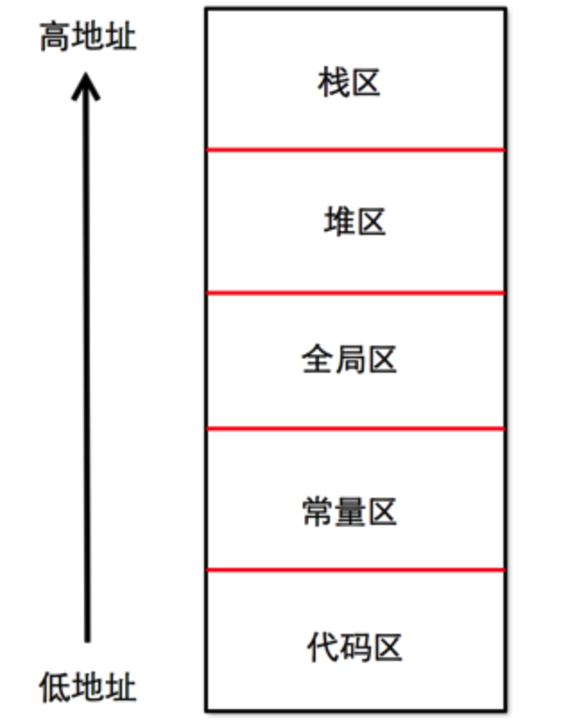

# 计算机内存

## 内存定义
&emsp&emsp内存也被称为内存储器，其作用是用于暂时存放CPU中的运算数据，以及与硬盘等外部存储器交换的数据。计算机中所有程序的运行都是在内存中进行的，CPU会把需要运算的数据调到内存中进行运算，当运算完成后CPU再将结果传送出来。

## 内存分类
&emsp&emsp内存包括`随机存储器(RAM)`、`只读存储器(ROM)`、`高速缓存(CACHE)`

1. 只读存储器
&emsp&emspROM表示只读存储器(Read Only Memory)，在制造ROM的时候，信息就被存入并永久保存。这些信息只能读出，一般不能写入，即使停电这些数据也不会丢失。ROM一般用于存放计算机的基本程序和数据，如BIOS ROM。其物理外形一般是双列直插式(DIP)的集成块

2. 随机存储器
&emsp&emsp随机存储器(Random Access Memory)表示既可以从中读取数据，也可以写入数据。当机器电源关闭时，存于其中的数据就会丢失。我们通常使用的内存条就是将RAM集成块集中在一起的一小块电路板。平时开发中使用的内存也说的是随机存储器。

3. 高速缓冲存储器
&emsp&emspCache高速缓冲存储器就是平常看到的`一级缓存(L1 Cache)`、`二级缓存(L2 Cache)`、`三级缓存(L3 Cache)`这些数据，它位于CPU与内存之间，是一个读写速度比内存更快的存储器。当CPU向内存中写入或读出数据时，这个数据也被存储进高速缓冲存储器中。当CPU再次需要这些数据时，CPU就从Cache读取数据，如需要的数据在Cache中没有，CPU会再去读取内存中的数据。

## 内存分配
内存的5大区域: 栈区，堆区，方法区，全局区，常量区

1. 栈区: 栈区由编译器自动分配并释放，存放函数的参数值，局部变量等。
    - 栈空间分静态分配和动态分配两种
        - 静态分配是编译器完成的，比如自动变量(auto)的分配
        - 动态分配是由alloca函数完成
    - 栈是向低地址扩展的数据结构，是一块连续的内存区域。栈顶的地址和栈的最大容量是系统预先规定好的。
    - 内存由系统自动分配，速度快，不会产生内存碎片。  
       
2. 堆区: 堆区是由程序员分配和释放。如果程序员不释放，程序结束时可能会由操作系统回收
    - 堆是函数库内部数据结构，不一定唯一，不同堆分配的内存无法互相操作。
    - 系统使用链表记录空闲的堆内存地址，当系统受到申请时，遍历该链表，寻找第一个空间大于所申请空间的堆结点，然后将该节点从空闲节点链表中删除，并将该节点的空间分配给程序。由于找到的堆节点的大小不一定正好等于申请的大小，系统会自动的将多余的那部分重新放入空闲链表中。
    - 堆是向高地址扩展的数据结构，是不连续的内存区域。而链表的遍历方向是由低地址向高地址。

3. 全局区(静态区): 存放全局变量和静态变量，程序结束后由系统释放
    - bss段: 存储未初始化的全局变量和静态变量
    - data段: 存放初始化了的全局变量和静态变量
4. 常量区: 存放常量字符串，程序结束后由系统释放
5. 程序代码区(方法区): 存放函数的二进制代码

