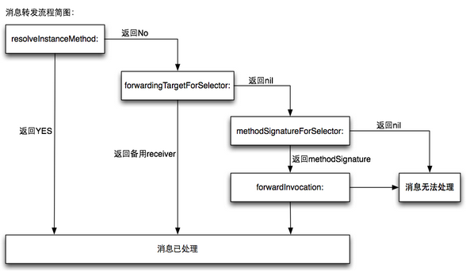

# 方法

## 类、分类、父类 方法执行顺序

#### load方法

- load 方法在main()函数执行之前执行，并且是在程序加载的时候自动调用
- 父类的load方法先执行，然后子类，然后分类，分类的执行顺序与分类的编译顺序有关
- 子类没有实现load方法不会调用父类的load方法

#### initialize方法
- initialize 方法在这个类或其子类接收第一条消息前调用
- 父类先执行子类后执行，子类没有实现父类会调用两次
- 分类会覆盖掉主类实现，后编译的分类会覆盖掉先编译的分类

#### 普通方法
- 普通方法分类会覆盖主类，后编译的覆盖先编译的，子类会覆盖父类

## 方法调用

  OC执行方法调用首先走消息`动态绑定`流程，先根据`selector`从方法缓存中查找有没有对应的方法，如果有则调用该方法，如果没有则去`方法列表`中查找，如果没有就去父类中查找，直到根类也没有，接下来走`动态解析`。
  `动态解析`，`Runtime`会调用类方法`+resolveInstanceMethod:`或`+resolveClassMethod:`，我们有机会在这个方法中为消息新增处理方法。
  如果动态解析不能够处理消息，那么接下来会走消息转发机制，调用方法`- (id)forwardingTargetForSelector:(SEL)aSelector`，此方法可以返回一个实际的消息接收者，对消息进行处理。
  如果上一步还不能处理消息，那么最后走完整消息转发，这是最后的机会。这一步对象会创建一个表示消息的`NSInvocation`对象，我们可以在`- (void)forwardInvocation:(NSInvocation *)anInvocation`方法中选择将消息转发给其他对象，同时要实现方法`- methodSignatureForSelector:`。