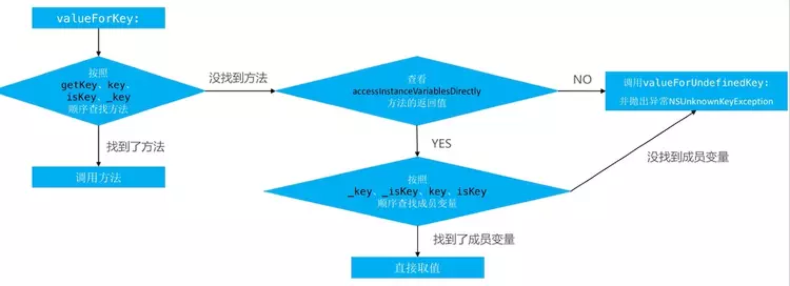

#KVC&KVO

## KVC
`KVC`是 key-value-coding ，键值编码

#### KVC 设置

KVC要设值，那么就要对象中对应的key，KVC在内部是按什么样的顺序来寻找key的。当调用setValue：属性值 forKey：@”name“的代码时，底层的执行机制如下：

- 程序优先调用set:属性值方法，代码通过setter方法完成设置。注意，这里的是指成员变量名，首字母大小写要符合KVC的命名规则，下同

- 如果没有找到setName：方法，KVC机制会检查`+ (BOOL)accessInstanceVariablesDirectly`方法有没有返回YES，默认该方法会返回YES，如果你重写了该方法让其返回NO的话，那么在这一步KVC会执行`setValue：forUndefinedKey：`方法，不过一般开发者不会这么做。所以KVC机制会搜索该类里面有没有名为_的成员变量，无论该变量是在类接口处定义，还是在类实现处定义，也无论用了什么样的访问修饰符，只在存在以_命名的变量，KVC都可以对该成员变量赋值。

- 如果该类即没有set：方法，也没有_成员变量，KVC机制会搜索_is的成员变量。

- 和上面一样，如果该类即没有set：方法，也没有_和_is成员变量，KVC机制再会继续搜索和is的成员变量。再给它们赋值。

- 如果上面列出的方法或者成员变量都不存在，系统将会执行该对象的setValue：forUndefinedKey：方法，默认是抛出异常。

- 简单来说就是如果没有找到Set<Key>方法的话，会按照_key，_iskey，key，iskey的顺序搜索成员并进行赋值操作。
如果开发者想让这个类禁用KVC里，那么重写`+ (BOOL)accessInstanceVariablesDirectly`方法让其返回NO即可，这样的话如果KVC没有找到set:属性名时，会直接用`setValue：forUndefinedKey：`方法。

#### KVC 取值

当调用valueForKey：@”name“的代码时，KVC对key的搜索方式不同于setValue：属性值 forKey：@”name“，其搜索方式如下：
- 首先按get,,is的顺序方法查找getter方法，找到的话会直接调用。如果是BOOL或者Int等值类型， 会将其包装成一个NSNumber对象。

- 如果上面的getter没有找到，KVC则会查找`countOf`,`objectInAtIndex`或`AtIndexes`格式的方法。如果`countOf`方法和另外两个方法中的一个被找到，那么就会返回一个可以响应`NSArray`所有方法的代理集合(它是`NSKeyValueArray`，是`NSArray`的子类)，调用这个代理集合的方法，或者说给这个代理集合发送属于NSArray的方法，就会以`countOf`,`objectInAtIndex`或`AtIndexes`这几个方法组合的形式调用。还有一个可选的`get:range:`方法。所以你想重新定义KVC的一些功能，你可以添加这些方法，需要注意的是你的方法名要符合KVC的标准命名方法，包括方法签名。

- 如果上面的方法没有找到，那么会同时查找`countOf`，`enumeratorOf`,`memberOf`格式的方法。如果这三个方法都找到，那么就返回一个可以响应NSSet所的方法的代理集合，和上面一样，给这个代理集合发NSSet的消息，就会以`countOf`，`enumeratorOf`,`memberOf`组合的形式调用。

- 如果还没有找到，再检查类方法`+ (BOOL)accessInstanceVariablesDirectly`,如果返回YES(默认行为)，那么和先前的设值一样，会按`_,_is,,is`的顺序搜索成员变量名，这里不推荐这么做，因为这样直接访问实例变量破坏了封装性，使代码更脆弱。如果重写了类方法`+ (BOOL)accessInstanceVariablesDirectly`返回NO的话，那么会直接调用`valueForUndefinedKey:`方法，默认是抛出异常。

#### KVC处理集合类型
- `@avg`， `@count`， `@max`， `@min`，`@sum`

## KVO
键值监听，观察者模式的一种

当一个对象使用了KVO监听，iOS系统会修改这个对象的isa指针，改为指向一个全新的通过Runtime动态创建的子类 NSKVONotifying_对象的类，子类拥有自己的set方法实现，set方法实现内部会顺序调用

willChangeValueForKey：方法
原来的setter方法实现
didChangeValueForKey：方法

而didChangeValueForKey：方法内部又会调用监听器的observeValueForKeyPath:ofObject:change:context:监听方法。