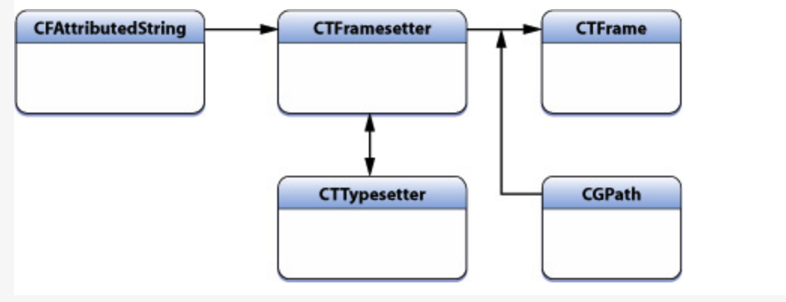
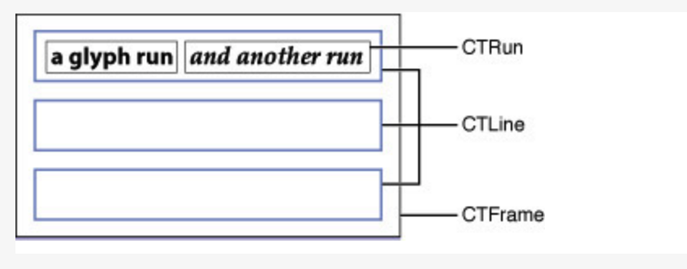
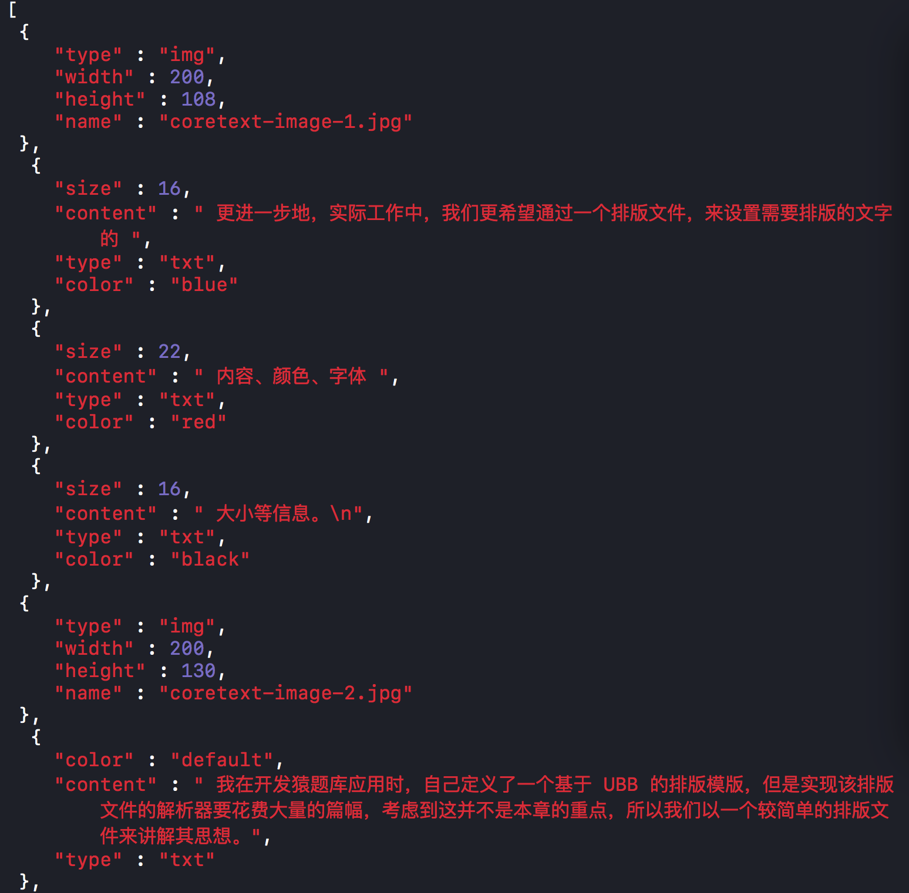

# CoreText

富文本
- 展示富文本的种类
  - CoreText
  - AttributedString

## 简介

- 字符和字形  
　　字符是信息本身的元素，而字形是字符的图形表征，字符还会有其它表征比如发音。 字符在计算机中其实就是一个编码，某个字符集中的编码，比如Unicode字符集，就囊括了大都数存在的字符。 而字形则是图形，一般都存储在字体文件中，字形也有它的编码，也就是它在字体中的索引。 一个字符可以对应多个字形（不同的字体，或者同种字体的不同样式:粗体斜体等）；多个字符也可能对应一个字形，比如字符的连写（ Ligatures）

- 坐标系  
　　Core Graphics的context使用的坐标系的原点是在左下角，iOS的UIView的drawRect方法的context被做了次flip，如果你啥也不做处理，直接在这个context上进行Core Text绘制，你会发现文字是镜像且上下颠倒。 

## Core Text对象模型

- CoreText 绘制的流程

- framesetter framesetter对应的类型是 CTFramesetter，通过CFAttributedString进行初始化，它作为CTFrame对象的生产工厂，负责根据path生产对应的CTFrame 
- CTFrame 绘制的整个文本算作一个CTFrame CTFrame是可以通过CTFrameDraw函数直接绘制到context上的，当然你可以在绘制之前，操作CTFrame中的CTLine，进行一些参数的微调
    - CTFrame 内部有多个 CTLine 组成，每个 CTLine 代表一行，每个 CTLine 由多个 CTRun 组成，每个 CTRun 代表一组显示风格一致的文本。我们不用手工管理 CTLine 和 CTRun 的创建过程。
    - 下图是一个 CTLine 和 CTRun 的示意图，可以看到，第三行的 CTLine 是由 2 个 CTRun 构成的，第一个 CTRun 为红色大字号的左边部分，第二个 CTRun 为右边字体较小的部分。

    - 虽然我们不用管理CTRun的创建过程，但是我们可以设置某一个具体的CTRun的CTRunDelegate来指定该文本在绘制时的高度、宽度、排列对齐方式等信息。
  - CTLine 可以看做Core Text绘制中的一行的对象 通过它可以获得当前行的line ascent,line descent ,line leading,还可以获得Line下的所有Glyph Runs
  - CTRun 或者叫做 Glyph Run，是一组共享想相同attributes（属性）的字形的集合体

　　Core Text本身并不支持图片绘制，图片的绘制你还得通过Core Graphics来进行。只是Core Text可以通过CTRun的设置为你的图片在文本绘制的过程中留出适当的空间。这个设置就使用到CTRunDelegate了，看这个名字大概就可以知道什么意思了，CTRunDelegate作为CTRun相关属性或操作扩展的一个入口，使得我们可以对CTRun做一些自定义的行为。为图片留位置的方法就是加入一个空白的CTRun，自定义其ascent，descent，width等参数，使得绘制文本的时候留下空白位置给相应的图片。然后图片在相应的空白位置上使用Core Graphics接口进行绘制。  

　　使用CTRunDelegateCreate可以创建一个CTRunDelegate，它接收两个参数，一个是callbacks结构体，一个是所有callback调用的时候需要传入的对象。 callbacks的结构体为CTRunDelegateCallbacks，主要是包含一些回调函数，比如有返回当前run的ascent，descent，width这些值的回调函数，至于函数中如何鉴别当前是哪个run，可以在CTRunDelegateCreate的第二个参数来达到目的，因为CTRunDelegateCreate的第二个参数会作为每一个回调调用时的入参  

- 绘制步骤
    - 获取上下文
    - 将 Core Text 坐标转换到 UIView 坐标
    - 创建可变路径
    - 创建CTFrameRef, 根据路径的形状创建这个frame
    - 绘制frame

## 图文混排文章，可以点击图片，点击链接

1. 获取文章内容和格式，可以使用json接收，格式如下图

　　每个字典对应一段文字内容及其展示的格式，包括大小、颜色等。

2. 解析json内容，按文本的类型分别进行解析归类
    - 普通文本
        - 文字颜色
        - 文字内容
        - 文字大小
    - 图片
        - 获取图片的宽高
        - 图片的名字
    - 链接文字
        - 文字颜色
        - 文字内容
        - 文字大小
        - 链接网址
3. 根据文本的内容，格式创建排版信息。CoreText 存储排版的是字符串，不会存储图片。想要排版图片需要使用一个占位的字符串，然后将图片放到占位字符串的位置
    - 创建一个属性字符串attStr，存储所有排版信息。
    - 普通文本
        - 根据文本的内容、颜色、大小创建属性字符串，按顺序拼接到attStr里。
    - 图片
        - 保存图片的名字或URL。
        - 保存图片的占位字符串在attStr中的起点位置。
        - 根据图片信息创建占位字符串
            - 根据图片的宽高设置CTRunDelegate，从而设置占位字符串的宽高。
            - 设置占位字符串属性，包括宽高。
        - 将占位字符串拼接到attStr里
    - 链接
        - 获取链接文字在attStr中的起点位置
        - 根据链接文字的颜色、大小、内容等信息创建属性字符串。拼接到attStr里
        - 获取链接文字的长度和范围（Range）。
        - 保存链接URL、文字内容、文字范围
    - 配置全局信息
        - 根据全局的排版信息配置各自的字符串属性。如果有相同配置，以自己的为准
4. 根据文本的排版信息创建 CTFrame
    - 根据 attStr 创建 CTFramesetterRef 
    - 根据 CTFramesetterRef 和绘制的宽度获取排版所需的高度
    - 根据排版的宽高创建绘制路径 path
    - 根据 path 和 CTFramesetterRef 创建 CTFrameRef
    - 根据 CTFrameRef 获取图片占位符在控件上的坐标。
        - 根据 CTFrame 获取所有的 Line 和每个 Line 的起始点 originP。
        - 遍历所有的 Line
        - 获取 Line 中的所有 Run
        - 遍历 Run
        - 获取 Run 的属性字典，获取字典的 `kCTRunDelegateAttributeName` key 对应的值，这个值是 Run 的代理属性。判断这个属性有没有值，没有值说明这个 Run 不是图片的占位符的 Run，跳过这次循环进入下一次循环。
        - 获取 Run 的代理对象，是个字典，判断类型如果不是字典则跳过此次循环。
        - 根据 Run 获取字形 Run 的相关属性，ascent、descent、width。
        - 根据 ascent 和 descent 获取字形的高。ascent + descent。
        - 获取 Run 在 Line 中 x 轴的偏移量 offset_x。
        - Line 的 originP.x + offset_x 就是 Run 在 CTFrame 中的 x 轴坐标。
        - Line 的 originP.y 就是 Run 在 CTFrame 中 y 轴的坐标。
        - 创建 Run 在 CTFrame 中的 Frame runBounds
        - 根据 CTFrame 获取排版路径 pathRef
        - 根据 pathRef 获取 CTFrame 在控件中的 Frame colRect
        - 根据 runBounds 和 colRect 计算 Run 在控件中的位置 delegateBounds
        - 保存 delegateBounds
        
5. 根据排版信息绘制所有文本，要在view的drawRect方法中绘制。
    - 获取上下文
    - 翻转上下文，CoreText的坐标系是屏幕的左下角，而UIKit的坐标系在屏幕的左上角，为了统一坐标系需要翻转上下文。
    - 将CTFrame绘制到上下文中
    - 根据图片URL创建图片
    - 根据图片位置绘制图片

6. 图片点击
    - 遍历图片信息
    - 图片保存的位置是 CoreText 坐标系，所以先将图片的坐标系转成 UIKit 坐标系 imageRect
    - 判断触摸点是否在 imageRect 内，如果在就代表点击了这个图片
7. 链接点击
    - 根据 CTFrame 获取 所有的 Line
    - 获取所有 Line 的起始坐标
    - 遍历所有 Line
    - 根据 Line 和 Line 的起始点获取 Line 的 Rect
    - 翻转坐标系，转换到 UIKit 坐标系
    - 判断点击的点是否在当前 Line 上
    - 在当前 Line 上，获取触摸点相对于 Line 的坐标 relativePoint
    - 根据 Line 和 relativePoint 获取触摸点在所有字符串中的偏移量 idx
    - 判断 idx 在哪个链接字符串的范围内，如果找到返回对应的连接字符串信息。

